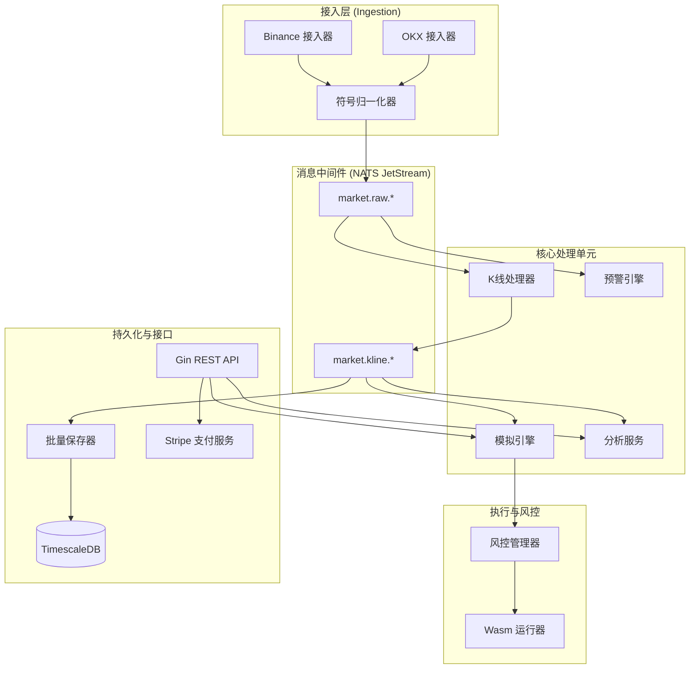

# Quant-Trader - 技术架构与引擎设计

本文档提供 `quant-trader` 架构的技术深度概览，涵盖其核心处理流水线以及商业级特性的集成设计。

## 1. 系统拓扑

`quant-trader` 采用 **模块化单体 (Modular Monolith)** 模式及 **事件驱动核心 (Event-Driven Core)**，在保持部署简便性的同时，实现了高性能的数据处理。

## 2. 组件职责

### 2.1 接入与归一化 (`internal/connector`)

- **接入器 (Connectors)**: 维护交易所的 WebSocket 连接池。实现心跳检测和指数退避重连机制。
- **归一化器 (Normalizer)**: 在进入 NATS 总线前，将交易所特有的交易对符号（如 `BTC-USDT`）转换为统一的 `BTCUSDT` 标准。

### 2.2 处理中枢 (`internal/processor`)

- **K线处理器 (KlineProcessor)**: 使用内存滑动窗口将原始成交聚合为多个时间周期（1m, 5m, 1h 等）。
- **预警引擎 (AlertEngine)**: 实时评估技术指标和价格规则，触发预警通知。

### 2.3 交易模拟 (`internal/paper`)

- **模拟引擎 (PaperEngine)**: 提供高并发订单撮合。维护虚拟余额，并根据通过 NATS 分发的实时市场成交数据执行订单。

### 2.4 风控与策略执行 (`internal/risk`, `internal/strategy`)

- **风控管理器 (RiskManager)**: 在订单执行前进行拦截，校验全局及用户级的风控限制（如最大持仓、最大单日亏损）。
- **Wasm 运行器 (WasmRunner)**: 在隔离的 WebAssembly 沙箱中执行交易策略，确保自定义逻辑不会危及系统稳定性。

### 2.5 分析与数据 (`internal/analytics`, `internal/storage`)

- **分析服务 (AnalyticsService)**: 基于 TimescaleDB 中存储的历史表现数据，计算高级指标（夏普比率、胜率、最大回撤）。
- **批量保存器 (BatchSaver)**: 高吞吐量持久化层，将进入的 NATS 消息打包为 SQL COPY 操作或批量 INSERT。

## 3. 核心设计决策

### 3.1 事件驱动解耦

通过使用 **NATS JetStream**，我们将接入层与处理层完全解耦。这确保了即使持久化层负载过高，行情数据仍能无延迟地流向实时模拟引擎。

### 3.2 时序数据优化

使用 **TimescaleDB** 超表 (Hypertables) 存储行情数据，优势包括：

- **高效压缩**: 降低历史 Tick 数据的存储成本。
- **数据留存**: 通过留存策略自动删除过期数据。

### 3.3 基于隔离的安全设计 (WASM)

交易策略不直接在 Go 进程中运行，而是通过 **WebAssembly (wazero)** 执行：

- **故障隔离**: 崩溃的策略不会导致整个交易引擎宕机。
- **资源限制**: 为每个策略实例配置可控的内存和 CPU 配额。

## 4. 业务流程

### 4.1 交易执行流

1. **API 调用**: 用户提交模拟订单。
2. **风控检查**: `RiskManager` 验证订单合法性。
3. **引擎准入**: 订单加入 `PaperEngine` 待撮合列表。
4. **撮合匹配**: 当新的成交消息通过 NATS 到达时，`PaperEngine` 检查成交条件。
5. **结算完成**: 更新并持久化账户持仓与余额。

### 4.2 技术指标流水线

1. **原始成交**: 从交易所实时到达。
2. **K线构建**: `KlineProcessor` 更新当前 K 线状态。
3. **指标计算**: `Indicator` 库更新 RSI/MACD 等数值。
4. **预警触发**: 若符合预设规则，`AlertEngine` 发出通知。

## 5. 开发标准

- **Internal 包隔离**: 核心逻辑封装在 `internal/` 下，防止外部模块绕过标准接口。
- **Context 感知**: 所有长运行服务均遵循 `context.Context`，确保优雅停机。
- **结构化日志**: 全局使用 `zap` 日志，通过 Field 机制方便日志聚合与分析。
