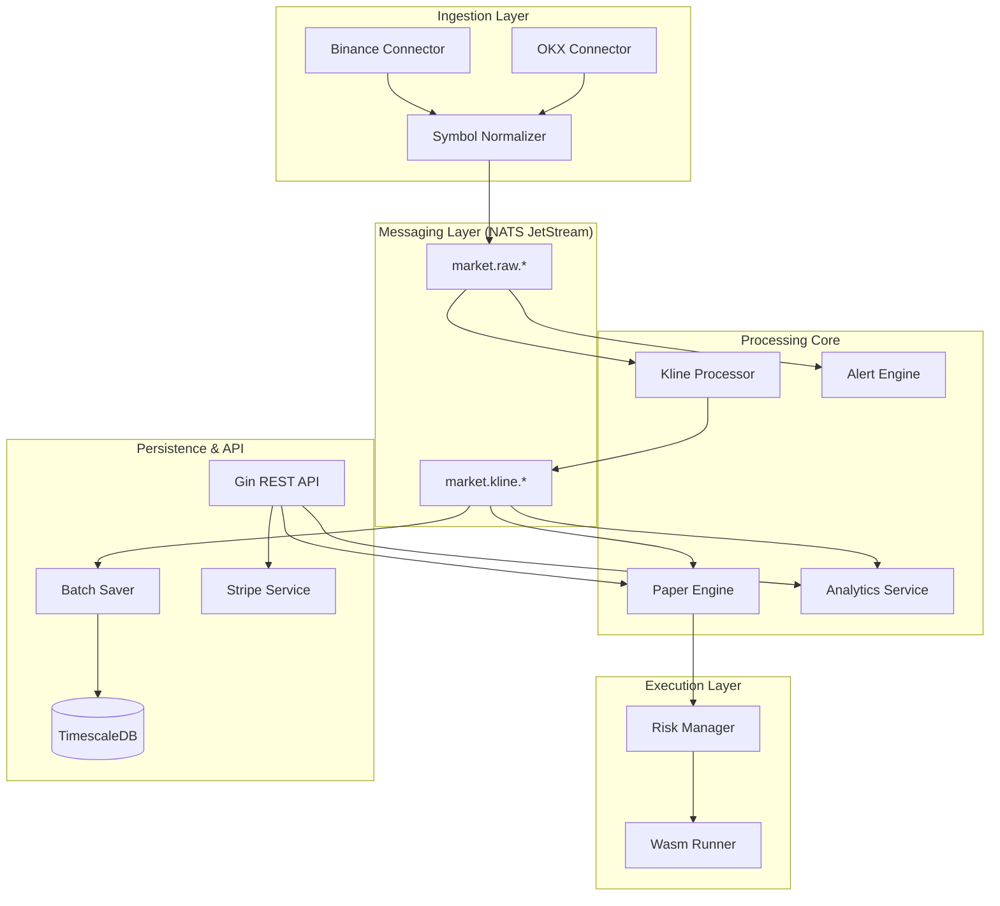

# Quant-Trader - Technical Architecture & Engine Design

This document provides a detailed technical overview of the `quant-trader` architecture, its core processing pipelines, and the integration of commercial-grade features.

## 1. System Topology

`quant-trader` follows a **Modular Monolith** pattern with an **Event-Driven Core**, allowing for high-performance data processing while maintaining ease of deployment.

## 2. Component Responsibility

### 2.1 Ingestion & Normalization (`internal/connector`)

- **Connectors**: Maintain WebSocket pools with exchanges. Implement heartbeat checks and exponential backoff reconnection.
- **Normalizer**: Converts exchange-specific symbols (e.g., `BTC-USDT`) to a unified `BTCUSDT` standard before entering the NATS bus.

### 2.2 Processing Hub (`internal/processor`)

- **KlineProcessor**: Aggregates raw trades into multiple timeframes (1m, 5m, 1h, etc.) using an in-memory sliding window.
- **AlertEngine**: Evaluates technical indicators and price rules in real-time.

### 2.3 Trading Simulation (`internal/paper`)

- **PaperEngine**: Provides high-concurrency order matching. It maintains virtual balances and executes orders against the live market feed distributed via NATS.

### 2.4 Risk & Execution (`internal/risk`, `internal/strategy`)

- **RiskManager**: Intercepts orders before execution to validate against global and per-user risk limits (e.g., max position size, max daily loss).
- **WasmRunner**: Executes trading strategies in an isolated WebAssembly sandbox, ensuring that custom logic cannot compromise system stability.

### 2.5 Analytics & Data (`internal/analytics`, `internal/storage`)

- **AnalyticsService**: Calculates high-level metrics (Sharpe Ratio, Win Rate, Max Drawdown) based on historical performance stored in TimescaleDB.
- **BatchSaver**: High-throughput persistence layer that batches incoming NATS messages into SQL COPY operations or batched INSERTs.

## 3. Key Design Decisions

### 3.1 Event-Driven Decoupling

By using **NATS JetStream**, we decouple the ingestors from the processors. This ensures that even if the persistence layer is under heavy load, market data continues to flow to the real-time simulation engine without delay.

### 3.2 Time-Series Optimization

**TimescaleDB** hypertables are used for storing market data. This allows for:

- **Efficient Compression**: Reducing storage costs for historical tick data.
- **Data Retention**: Automated deletion of old data using retention policies.

### 3.3 Security through Isolation (WASM)

Instead of running strategies directly in the Go process, we use **WebAssembly (via wazero)**. This provides:

- **Fault Isolation**: A crashing strategy won't crash the entire trading engine.
- **Resource Limits**: Configurable memory and CPU quotas for each strategy instance.

## 4. Operational Flows

### 4.1 Trade Execution Flow

1. **API Call**: User submits a paper order.
2. **Risk Check**: `RiskManager` validates the order.
3. **Engine Entry**: Order is added to the `PaperEngine` pending list.
4. **Matching**: When a new trade message arrives via NATS, `PaperEngine` checks for fills.
5. **Completion**: Portfolio balance is updated and persisted.

### 4.2 Technical Indicator Pipeline

1. **Raw Trade**: Arrives from exchange.
2. **K-Line Build**: `KlineProcessor` updates the current candle.
3. **Indicator Calculation**: `Indicator library` updates RSI/MACD values.
4. **Alert Check**: `AlertEngine` triggers if rules are met.

## 5. Coding Standards

- **Internal Package**: All core logic is hidden in `internal/` to prevent external modules from bypassing defined APIs.
- **Context-Aware**: Every long-running service respects `context.Context` for proper cancellation and graceful shutdown.
- **Structured Logging**: `zap` is used throughout the system with fields to allow for easy log aggregation and analysis.
