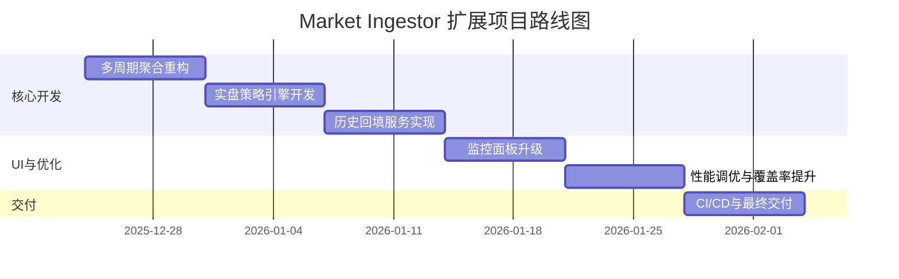

# 开发规划路线图 (6 周迭代计划)

## 1. 里程碑节点

- **W1: 基础设施增强** - 完成多周期聚合引擎重构。
- **W2: 策略引擎核心** - 实现 LiveStrategyEngine 并与 NATS 集成。
- **W3: 数据回填系统** - 完成 Backfill Service 与各交易所 REST API 对接。
- **W4: UI 与监控升级** - 开发策略监控面板与回测报告可视化。
- **W5: 性能优化与测试** - 进行全链路压测，提升单元测试覆盖率至 80%。
- **W6: 交付与部署** - 完善文档，实现 CI/CD 流水线，完成最终交付。

## 2. 详细周计划

### Week 1: Multi-Interval Aggregator
- 重构 `internal/processor/kline.go` 支持动态周期。
- 增加 NATS 多主题分发逻辑。
- 交付物：支持多周期的 KlineProcessor。

### Week 2: Live Strategy Engine
- 实现策略调度器（Strategy Scheduler）。
- 对接 `Strategy` 接口到实时数据流。
- 交付物：实盘信号触发引擎原型。

### Week 3: History Backfiller
- 实现 Binance/OKX 的历史 K 线拉取逻辑。
- 开发回填任务管理 API。
- 交付物：`internal/storage/backfiller.go` 及相关 API。

### Week 4: Dashboard & Visualization
- 前端集成信号展示组件。
- 后端增加回测结果 JSON 导出接口。
- 交付物：增强型 UI 监控页面。

### Week 5: Quality Assurance
- 编写针对多周期聚合的边界测试。
- 集成 Prometheus 指标监控策略执行延迟。
- 交付物：详细测试报告。

### Week 6: CI/CD & Delivery
- 配置 GitHub Actions 自动化测试与构建。
- 编写部署指南（Docker Compose）。
- 交付物：完整源代码与文档包。

## 3. 路线图 (Gantt Chart)

## 4. 风险应对预案
- **数据延迟**：若多周期处理导致延迟，引入 `Worker Pool` 模式并行处理不同交易对。
- **API 限制**：针对回填服务的 Rate Limit，引入令牌桶算法进行平滑限流。
- **内存压力**：对长期未活跃的聚合窗口进行定期清理。
